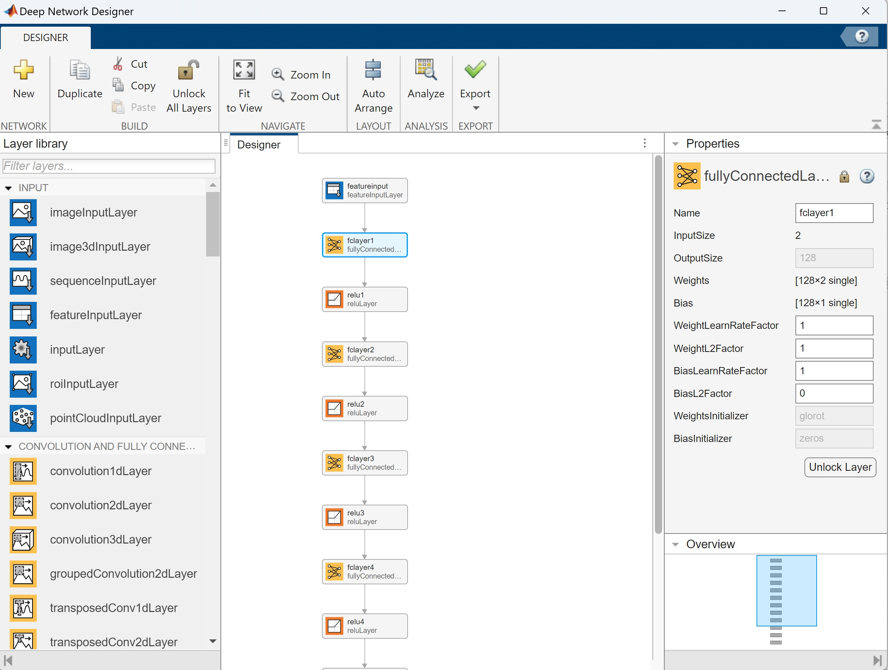
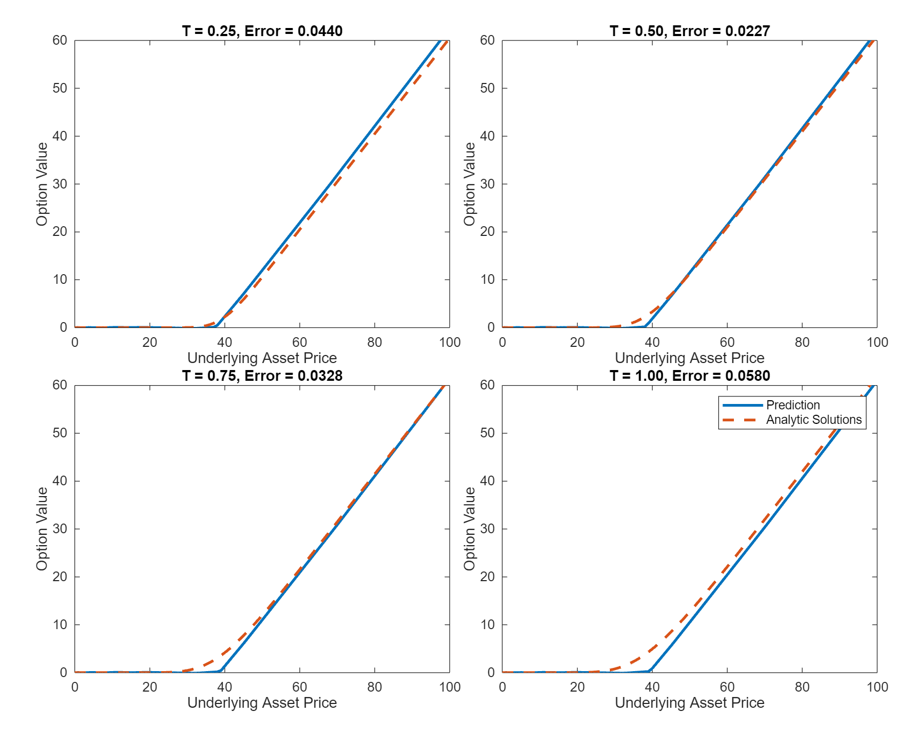

# Physics-Informed Neural Networks for Option Pricing
This demo shows how to use Physics-Informed Neural Networks (PINNs) to find the market value of call options in MATLAB&#174;. In this example, we utilize the [Optimization Toolbox&#8482;](https://www.mathworks.com/products/optimization.html) and [Deep Learning Toolbox&#8482;](https://www.mathworks.com/products/deep-learning.html).

## Background

The Black-Scholes equation is a widely used mathematical model for pricing options and other financial derivatives. It describes the price evolution of an option over time, taking into account factors such as the underlying asset price, volatility, risk-free interest rate, and the option's strike price and maturity. 

The Black-Scholes equation is a partial differential equation (PDE) of the form:

$\displaystyle\frac{\partial V}{\partial t}+\frac{1}{2}\sigma^2S^2\frac{\partial^2 V}{\partial S^2}+rS\frac{\partial V}{\partial S}-rV=0$

$V(T,S)= K(S)$

where $V(t,S)$ is the price of the option as a function of stock price $S$ and time $t$, $r$ is the risk-free interest rate, and $\sigma$ is the volatility of the stock returns.

The Black-Scholes equation has an analytical solution, known as the Black-Scholes formula, which gives the exact option price under certain assumptions. However, in more complex scenarios or when the assumptions are violated, numerical methods are often employed to solve the equation. 

Physics-Informed Neural Networks (PINNs) are a class of deep learning models that incorporate physical laws and domain knowledge into the neural network training process. PINNs are particularly useful for solving PDEs and other physical systems, as they can learn the solution while respecting the underlying governing equations. 

The key idea behind PINNs is to use the neural network to represent the solution to the PDE and then define a loss function that consists of two parts: 

- The mismatch between the neural network predictions and the initial and boundary conditions. 
- The residual of the PDE, which measures how well the neural network satisfies the governing equation.

By minimizing this composite loss function, the neural network learns to approximate the solution to the PDE while adhering to the physical constraints. 

## Solving the Black-Scholes Equation with PINNs 

In this example, we demonstrate how to solve the Black-Scholes equation using PINNs in MATLAB. The main steps involved are: 

1. Generate training data: We create a set of input points (stock prices and times) and corresponding initial and boundary conditions based on the Black-Scholes formula.
2. Define the neural network architecture: We construct a fully connected neural network with a suitable number of layers and neurons to represent the option price function.
3. Customize the loss function: We implement a customized loss function that includes the mismatch between the neural network predictions and the initial and boundary conditions, as well as the residual of the Black-Scholes equation. 
4. Train the neural network: We use the Adam optimizer algorithm to minimize the loss function and learn the optimal network parameters.
5. Evaluate the trained model: We compare the neural network predictions with the analytical solutions.

## Set up the Neural Networks

We can visualize and change the settings from [Deep Network Designer](https://www.mathworks.com/help/deeplearning/gs/get-started-with-deep-network-designer.html). In this app, you easily build deep learning networks interactively. Analyze the neural networks to check if the defined architecture is correct and detect problems before training.

## Model Evaluation

In this section, we compare the numerical solutions with the analytic solutions to Black Scholes PDE at different maturity time $T=0.25, 0.5, 0.75,1$.

Comparing the prediction and analytical solutions, the PINNs approximation has the accuracy in the shape of the true solutions. However, the PINNs perform underestimates from the analytic solutions as the maturity time  increases. The accuracy could be improved by considering different types of loss functions. In the current settings, the total loss function is consisted by three components: PDE loss, initial value loss, and boundary value loss. The results may be improved by trying smooth $L1$ loss. Another way is to try different neural networks. The activation layers used in the current settings are ReLU Activations. Recommend testing wider networks over deeper ones, utilizing $\tanh$  activation function.

## Reference:
 - [Solve Partial Differential Equation with L-BFGS Method and Deep Learning](https://www.mathworks.com/help/deeplearning/ug/solve-partial-differential-equations-with-lbfgs-method-and-deep-learning.html)
 - [Solve Poisson Equation on Unit Disk Using Physics-Informed Neural Network](https://www.mathworks.com/help/pde/ug/solve-poisson-equation-on-unit-disk-using-pinn.html)
 - A. Dhiman, Y. Hu, Physics Informed Neural Network for Option Pricing, [arXiv:2312.06711](https://arxiv.org/abs/2312.06711)
 - S. Wang, S. Sanharan, H. Wang, and P. Perdikaris, An expert's guide to training physics-informed neural networks, [arXiv:2308.08468](https://arxiv.org/abs/2308.08468)